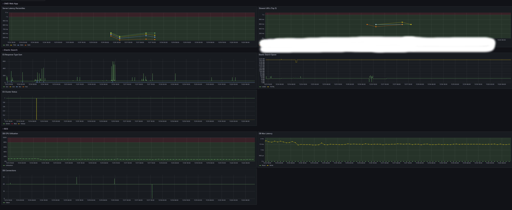

# OpenMetaData Dashboard

This repository contains the JSON configuration for the Grafana dashboard used to monitor various aspects of OpenMetaData's infrastructure.

## Dashboard Configuration

The `dashboard.json` file in this repository contains the configuration for the Grafana dashboard. It includes panels for monitoring different services and resources related to OpenMetaData.

### Panels Included

1. **OMD Web App**: Overview panel for the OpenMetaData web application.
2. **Server Latency Percentiles**: Monitors latency percentiles for the server.
3. **Slowest URI's (Top 5)**: Tracks the slowest URIs in the system.
4. **Elastic Search**: Monitoring ES response types and space usage.
5. **ES Cluster Status**: Monitors the status of the ES cluster.
6. **DB CPU Utilization**: Monitors CPU utilization in the database.
7. **DB Max Latency**: Tracks maximum latency in the database for reads and writes.
8. **DB Connections**: Monitors database connections based on different roles.

## How to Use

1. Clone this repository:

   ```bash
   git clone <repository_url>
   
Import the dashboard.json file into your Grafana instance:

Log in to Grafana.   
Go to Create -> Import.   
Upload the dashboard.json file.   
Review and customize the dashboard as needed.   

Note: You need to customize the dashboard to your application.   
Treat this just as a starting template.  



